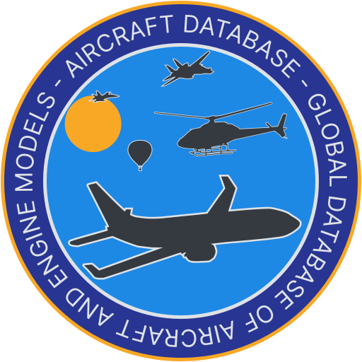

    

# Aircraft database

Global database of aircraft and engine models.

## Project's goal

The goal is to gather as much technical data as possible on aircraft around the world, and to make them accessible in a
synthetic, readable way (Did someone say "tables"?).

Why? The data concerned are often publicly available but are scattered in several documents (FAA and/or EASA Type
Certificate Data Sheets, Airport Planning Manuals, manufacturer datasheets, commercial leaflets) which are not always
very easy to interpret, nor pleasant to read.

## Data sources

The data comes from:

- FAA and/or EASA Type Certificate Data Sheets;
- Aircraft Operating Manuals;
- Airport Planning Manuals;
- Manufacturer datasheets;
- Commercial leaflets;
- Museums, Books.

## License

The source code is published under the terms of the [MIT license](https://spdx.org/licenses/MIT.html). However, there is
not much to see. It’s more or less a basic Symfony application with CRUD and stuff like that.

The data is published under the terms of the [ODC-By 1.0](https://opendatacommons.org/licenses/by/1-0/) license.
